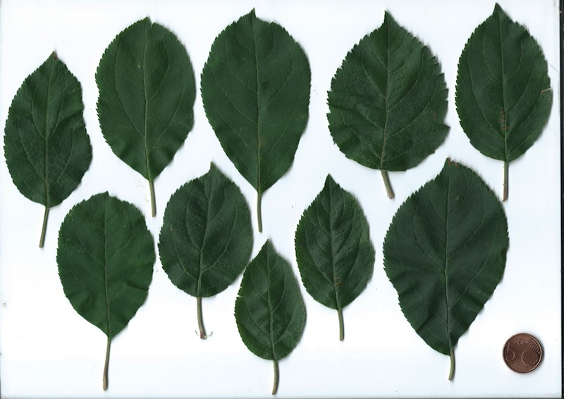

# Protocole feuilles fruitiers
_Version 5.20_

Merci de votre intérêt pour le projet Marmelade !
L'axe "feuilles" en est le premier et son protocole de collecte est simple.

### :man_cook: Ingrédients  
* au moins un arbre dont vous connaissez la variété, sur lequel prélever au moins 20 feuilles ;
* un scanner couleur, même premier prix, même poussiéreux ;
* de 15 minutes environ par arbre ;
* d'accepter de déposer vos données dans le domaine public.

### :deciduous_tree: Choix de l'arbre et de la variété
* **Les pruniers et pommiers** sont particulièrement recherchés pour ce premier essai mais vous pouvez participer avec les espèces qui vous plaisent
* On priviligiera les arbres **produisant des fruits**, plantés depuis au moins une année pleine. Si cela vous fait peine de sacrifier 20 feuilles pour la science, c'est que votre arbre est trop jeune.
* Si vous avez plusieurs espèces et variétés sous la main, mais que vous n'avez pas le temps ou l'envie de toutes les faire, privilégiez les variétés qui vous paraissent les plus rares.
* Si vous avez plusieurs arbres de la même variété, ces répétitions statistiques seraient extrêmement précieuses ! Chaque individu arbre doit faire l'objet de dépôts séparés sur le formulaire.

### :scissors: Prélèvement des feuilles
* 1 dépôt sur le [formulaire en ligne](https://forms.gle/88nU4t7EueY1fg348) = 1 arbre, éventuellement en plusieurs scans
* **20 feuilles par arbre minimum. Idéalement 30**. Pas de maximum.
* Feuilles bien développées, prélevées au milieu du rameau (ni trop vers le tronc, ni trop vers l'apex) ;
* Si possible, changez de rameau à chaque feuille et prélevez tout autour de l'arbre.
* Feuilles en bon état, de taille et de forme "normale", si possible sans marque d'herbivorie ou autres dommages, notamment sur la marge de la feuille, c'est à dire son pourtour.
* Si vous ne pouvez pas scanner juste après la récolte, empiler les feuilles et les placer dans une enveloppe kraft au frigo : vous avez environ 48 heures.

### :printer: Numérisation
* Scanner couleur A4, résolution 300 dpi minimum, 600 ou plus si possible ;
* On scanne la face du dessus et donc on pose les feuilles "à l'envers" ;
* Les feuilles ne doivent pas se recouvrir ;
* Placez une pièce de 5 centimes d'euros dans le bord inférieur droit pour l'échelle ;
* Les fichiers bruts non modifiés sont déposés sur le formulaire : pas de recadrage ni de retouche.

Vous devriez obtenir ce genre d'images, ici un pommier "Reinette d'Alboulne" :

### :postbox: Dépôt fichier
* **Le dépot du ou des fichiers se fait sur le [formulaire en ligne](https://forms.gle/88nU4t7EueY1fg348)**
* Non Google Drive n'est pas la panacée mais j'y travaille.

### :vulcan_salute: Dépôt dans le domaine public

Un aspect essentiel du projet est le dépôt volontaire de vos productions dans le domaine public.

La licence [Creative Commons 0](https://creativecommons.org/publicdomain/zero/1.0/deed.fr) garantit que ni vous, ni moi, ni des gentils, ni des méchants, ni **personne ne puisse s'accaparer _votre_ propriété intellectuelle sur _vos_ données, puisque _vous_ avez décidé qu'elles étaient publiques, donc à tout le monde.**

Le dépôt d'images est conditionné par votre accord, et vous n'avez, à part cela, rien à faire. Les images seront déposées sur un serveur avec une licence CC0 globale. Vos images partageront donc la même licence que les [Variations Goldberg](https://opengoldbergvariations.org/) de Bach, [_Le portrait de Dorian Gray_](https://fr.wikisource.org/wiki/Le_Portrait_de_Dorian_Gray) d'Oscar Wilde ou [_La Nuit des morts-vivants_](http://publicdomainmovies.net/movie/night-of-the-living-dead-3) de Romero !

Vous pouvez en lire davantage :

* Sur cette [page](https://creativecommons.org/publicdomain/zero/1.0/deed.fr) en français
* Sur la [page wikipedia francophone](https://fr.wikipedia.org/wiki/Licence_CC0)
* La [licence complète](https://creativecommons.org/publicdomain/zero/1.0/legalcode.fr) en français

### :phone: Hotline
Pour toute question, n'hésitez pas à me contacter par courriel ou téléphone :  

* <projet.marmelade@gmail.com>
* +33(0)6.95.90.55.79

Merci à vos arbres et merci à vous :kissing_heart: :deciduous_tree:

